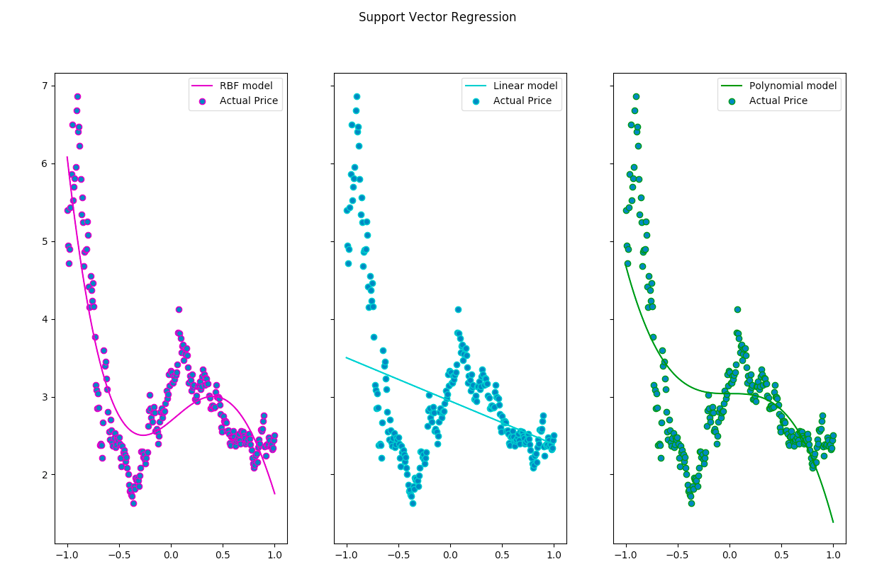

# Stock-Prediction practice
This is a homework assignment from Make Money with Machine Learning course. This project is written in python, numpy, scikit-learn and matplotlib. Use the stock history data from Yahoo Finance and apply regression analysis method.

Inspired by the code of [mediasittich](https://github.com/mediasittich/Predicting-Stock-Prices-with-Linear-Regression), [chaitjo](https://github.com/chaitjo/regression-stock-prediction/blob/master/svr.py), and the documentation of [SVM](https://scikit-learn.org/stable/auto_examples/svm/plot_svm_regression.html).
